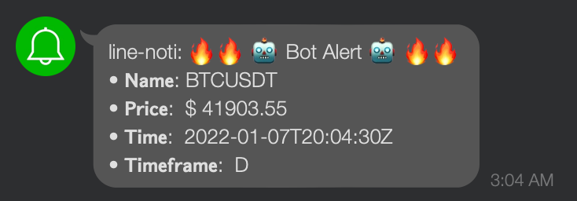
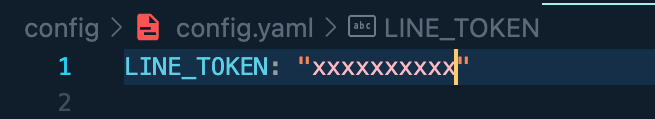
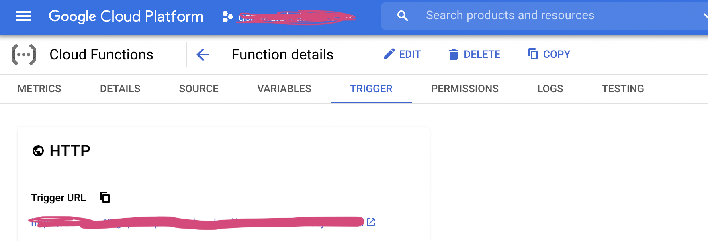
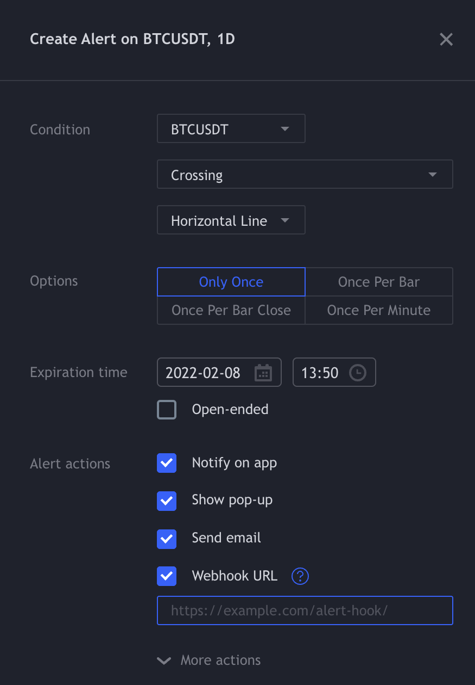
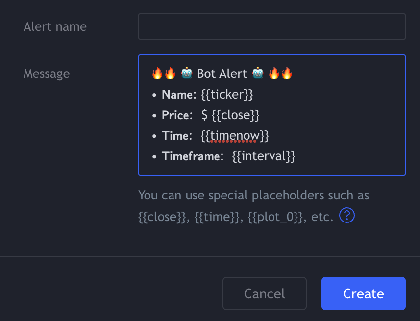

# proxy-line-noti-function
Wanna send alert from https://www.tradingview.com to your Line application? Let's `proxy-line-noti-function` helps you.  
## Overview  
`proxy-line-noti-function` allow you to redirect the alert from tradingview to your Line app  

  

## Prerequisite
- Google Cloud Platform account 
    - Generate service account 
    - Enable Cloud Function & Cloud Build Api
- Google Cloud SDK
    - Activate service account
- Trading View account
- Line account
    - Add `Line Notify` friend from https://notify-bot.line.me/en/  

## Setup
1. Generate Line token from https://notify-bot.line.me/en/  
2.  Create `config/config.yaml`  
      
3. **export** service account client email as **GCLOUD_EMAIL** (This variable will be used in `deploy.sh`)
    ```
    export GCLOUD_EMAIL="YOUR CLIENT EMAIL"
    ```
4. Deploy Cloud Function from `deploy.sh` (or in GCP Console)
    - After deployed you first function, you'll be receiving trigger url (endpoint) for you
      
5. Place your url endpoint in Webhook Url tradingview alert window  
      
    - Config your alert message  
      
6. Done!

Now wait for your alert.  
  
